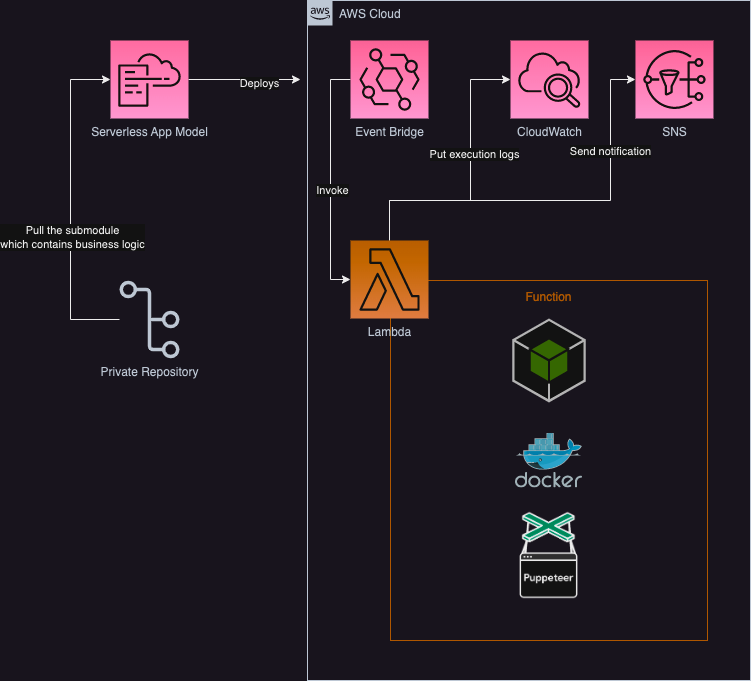
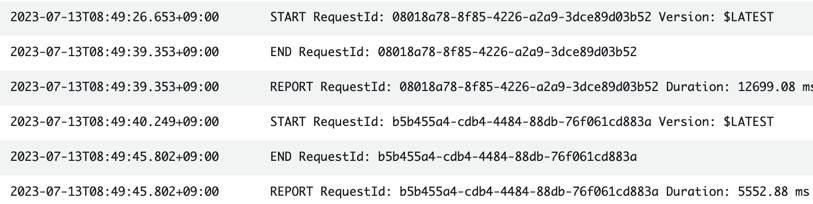
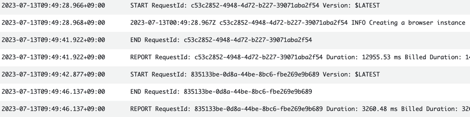

# Lambda Puppeteer

[](./README.kr.md)

This is an example repository of running [container image](https://www.docker.com/) based [AWS Lambda](https://aws.amazon.com/ko/lambda/) function containing [puppeteer](https://pptr.dev/).

# What tech stacks used & what it actually does

1. Node.js
    > Node.js® is an open-source, cross-platform JavaScript runtime environment. [^1]
2. Puppeteer
    > Puppeteer is a Node.js library which provides a high-level API to control Chrome/Chromium over the DevTools Protocol. [^2]
3. AWS Lambda
    > AWS Lambda is a serverless, event-driven compute service that lets you run code for virtually any type of application or backend service without provisioning or managing servers. [^3]
4. Docker
    > Docker is an open platform for developing, shipping, and running applications. Docker enables you to separate your applications from your infrastructure so you can deliver software quickly. With Docker, you can manage your infrastructure in the same ways you manage your applications. [^4]
5. AWS Serverless Application Model
    > The AWS Serverless Application Model (SAM) is an open-source framework for building serverless applications. It provides shorthand syntax to express functions, APIs, databases, and event source mappings. With just a few lines per resource, you can define the application you want and model it using YAML. During deployment, SAM transforms and expands the SAM syntax into AWS CloudFormation syntax, enabling you to build serverless applications faster. [^5]
6. Git Submodules
    > Submodules allow you to keep a Git repository as a subdirectory of another Git repository. This lets you clone another repository into your project and keep your commits separate. [^6]
7. AWS Event Bridge
    > EventBridge is a serverless service that uses events to connect application components together, making it easier for you to build scalable event-driven applications. Use it to route events from sources such as home-grown applications, AWS services, and third-party software to consumer applications across your organization. [^7]
8. CloudWatch and SNS will be implemented later.

tl;dr? Long story short, it is an AWS SAM template defining an AWS Lambda function based on a Docker container image. The image is a Node.js app with chrome installed. The app uses Puppeteer to execute a crawling job. The function is invoked periodically by an AWS Event Bridge schedule which is also defined in the template. And by using Git Submodules, it can import the code with business logic from a personal private repository.

# How to deploy

## Prerequisites

To use the SAM CLI, you need the following tools.

* Docker - [Install Docker community edition](https://hub.docker.com/search/?type=edition&offering=community)
* SAM CLI - [Install the SAM CLI](https://docs.aws.amazon.com/serverless-application-model/latest/developerguide/serverless-sam-cli-install.html)

## Commands

The Docker must be running in background!

```shell
sam build --template sample-template.yaml
```

```shell
sam deploy [--profile PROFILE_NAME]
```

After deployment, the console will show Outputs. An output with Key name of FunctionApi has Value describing an URL which can execute the deployed sample Lambda function. Once executed, it will return `{"message":"Google"}`, which is the title of the site hard-coded in `lambda/src/app.js`

# Improvements

## Increasing Lambda function execution speed

Creating Puppeteer's browser instance everytime the function is invoked was inefficient.
```JS
export const lambdaHandler = async (event, context) => {
    //...
   const browser = await launch({
        //...
   })
   //...
}
```
When invoking the function twice consequently:


The second invocation took **5552.88 ms**

Refactored browser instance to global scope, and create only if `browser` is `null` or `undefined` using `nullish coalescing assignment` operator.
```JS
/**
 * @type {import('puppeteer-core').Browser}
 */
let browser

export const lambdaHandler = async (event, context) => {
    //...
    browser ??= await createBrowserInstance()
    //...
}
```

When invoking the function twice consequently after refactoring:



The second invocation took **3260.48 ms**. The execution speed improved by **170%**


# Journey to creation of the repository

## Background

Having run an English-speaking meetup for 10 years, one of the most frustrating aspects has always been attracting new members. There's a website dedicated to meetup organizers like me to advertise and recruit new participants. However, this site, which I won't mention for privacy reasons, is swamped with around 400k users, including 80k daily active users. As a result, the advertisement board gets flooded with tons of posts every day, making it challenging for people to find what they're looking for due to the site's inaccurate and limited search indexing.

What's worse is that many users don't even try to bother search for an English speaking meetup unless they are exposed to my ad, so I constantly have to post advertisements to keep my meetup on the first page of the board. Not only is this bad for the readers, but it's also a headache for those of us writing the posts. To create a post, users have to go through a cumbersome login process, which doesn't even support OAuth. Furthermore, the site's insistence on location service permission during login seems unrelated to its actual purpose – it's just poor development.

After going through the hassle of logging in, users then have to navigate through a complicated board list menu to find the right section. Clicking the 'write new post' button requires filling out category, sub-category, title, and content fields. In my case, I had to copy and paste the title and content of my advertisement from a notes app repeatedly, as there are separate boards for advertisements, based on location and meetup type. All in all, it's a time-consuming and energy-draining process to repeat several times a day.

## The first approach: Using a Headless Browser.

To address these challenges, my initial solution was automation. As a JavaScript developer, Puppeteer[^2] was an obvious choice. Initially, I ran it on a local machine since I lacked cloud computing knowledge. However, relying on a cron job on a local machine proved unstable, as the computer sometimes needed to be shut down or faced internet connection failures.

## Migration to the Cloud: AWS EC2

For a few months, using a headless browser to post ads worked fine. But eventually, I decided to get rid of the desktop computer running the cron job and opted for a laptop, leading to the inevitable migration to a cloud environment. The easiest option was using AWs EC2, with the only adjustment being a change in the OS from macOS to Amazon Linux. Installing Chrome driver on Linux posed a small challenge, but overall, it worked smoothly.

## Containerization: AWS ECS

After a few years, the only recurring task was creating a new AWS account annually to maintain free tier benefits. Using AWS CloudFormation and EC2 user data[^8], I effortlessly set upt the same environment. The major change this time was the site I was using. The site's structure and number of boards had changed, with some being created, merged and deleted. This meant I had to update my source code after years. Developing and debugging became challenging due to the development environment being macOS while the deployment environment was on Amazon Linux 2 and later on Amazon Linux 2023 during its transition. To tackle this, I decided to containerize the app using Docker and deployed the image via AWS ECS Fargate[^9].

## Toward Serverless: AWS Lambda - Current

Adopting ECS Fargate had many advantages; I didn't have to worry about sudden crashes or implement logging. However, its pricing became an issue, as it wasn't part of the AWS free tier. I wanted a solution that reduced effort on a repeating job through simple coding without incurring costs. This led me to migrate once again, this time to AWS Lambda function. Since there were limited references on running headless browser on Lambda, I decided to reuse the container image on Lambda too[^10]. As a result, the cron job now works smoothly on the Cloud without any cost!

[^1]: https://nodejs.org/en
[^2]: https://pptr.dev/
[^3]: https://aws.amazon.com/lambda/?nc1=h_ls#How_it_works
[^4]: https://docs.docker.com/get-docker/#title
[^5]: https://aws.amazon.com/serverless/sam/
[^6]: https://git-scm.com/book/en/v2/Git-Tools-Submodules#_git_submodules
[^7]: https://docs.aws.amazon.com/eventbridge/latest/userguide/eb-what-is.html
[^8]: https://docs.aws.amazon.com/AWSEC2/latest/UserGuide/user-data.html
[^9]: https://docs.aws.amazon.com/AmazonECS/latest/userguide/what-is-fargate.html
[^10]: https://docs.aws.amazon.com/lambda/latest/dg/images-create.html